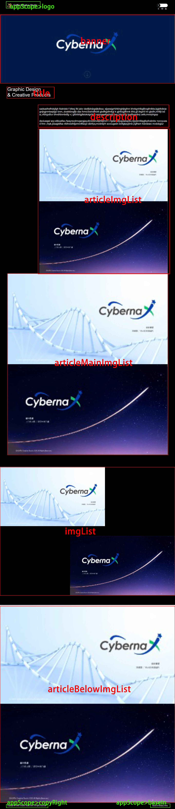

# 详情页配置项说明

## json格式如下

```json
{
  "banner": [
    "banner.jpg"
  ],
  "title": "Brand Identity\n& Visual Systems",
  "description": "sadsadhefhdsjfgh  fdahdsb f bfesj lfd jsbv dedfjdnjbgdjkdksa; e[pewjgrhihklnghjkglhm khnkgnhlkgfjhogfmlkte,kjgbfoikrjegnjbgjnmlsejdgo bnm,.dcskkbngfjb das fvmcl;kslndfhoitl gbdfkgdfmkgl k gjhfiogjfkhnk ithb,gf./legmt hn gbdfn,mhfljt bda;;vfdnjydfuv  bhvdhbvnbdfg v j gfdvbhjgfsiukoigrhk,s smnpwefophnjb,vxs./nbvirhg  bgdfngmbvj uefs;mvoiyhgop \n dsciuwgei wq;vdbiuefwu  fwayrscdmvgergjayufcrxcbnvkphtijlmm v fgdancdjvguwsqcbv,n[pykmfdagfsyfcxbnbv  nvcvyuesd fmn ;mpk,jbsagtdfsa nfdhvioiht[pmnnffwqyt  dbhfyq;mvdnbjrh scvcugedn bnfigkpyjtmb  jrgfhsm fcbniewo mvdcbgiur",
  "imgList": [
    "img-1.jpg",
    "img-2.jpg"
  ],
  "articleImgList": [
    "img-1.jpg",
    "img-2.jpg"
  ],
  "articleMainImgList": [
    "img-1.jpg",
    "img-2.jpg"
  ],
  "articleBelowImgList": [
    "img-1.jpg",
    "img-2.jpg"
  ]
}
```

## 配置项目对应图

> 下图中的绿色部分(以 "appScope>" 开头的部分)对应的配置项目在[home-view](./home-view.md)中


