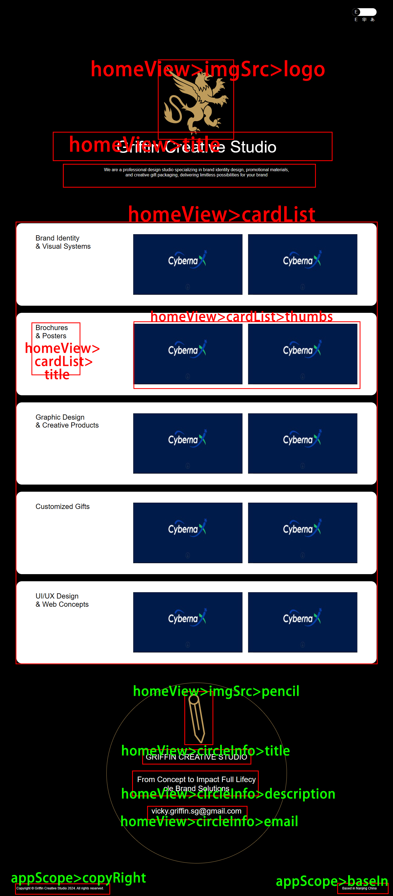

# 首页配置项说明

## json格式如下

```json
{
  "homeView": {
    "imgSrc": {
      "logo": "logo.png",
      "pencil": "pencil.png"
    },
    "title": "Griffin Creative Studio",
    "description": "We are a professional design studio specializing in brand identity design, promotional materials,\nand creative gift packaging, delivering limitless possibilities for your brand",
    "cardList": [
      {
        "title": "Brand Identity\n& Visual Systems",
        "thumbs": [
          "banner.jpg",
          "banner.jpg"
        ]
      },
    ],
    "circleInfo": {
      "title": "GRIFFIN CREATIVE STUDIO",
      "description": "From Concept to Impact Full Lifecycle Brand Solutions",
      "email": "vicky.griffin.sg@gmail.com"
    } 
  },
  "appScope": {
    "logo": "logo.png"
  }
}
```

## 配置项目对应图

